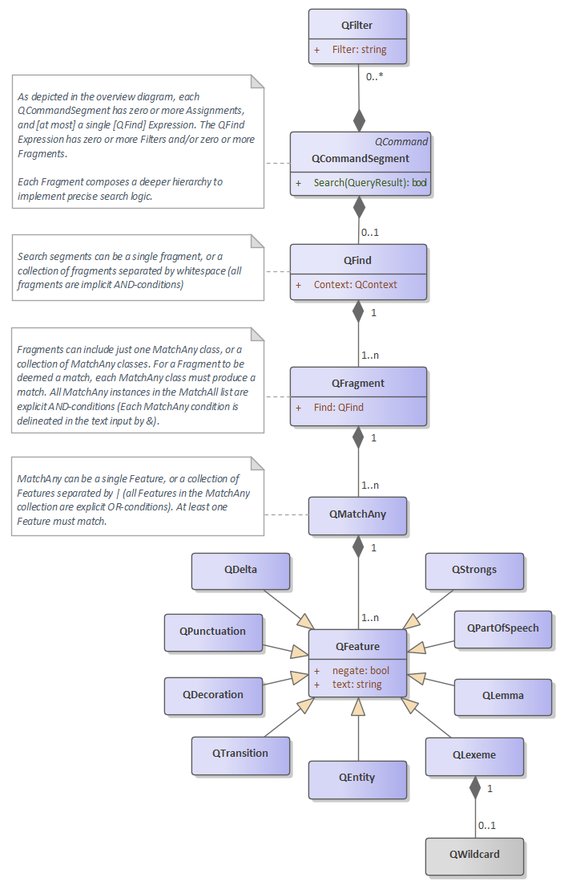

# Quelle Specification for AVX Framework

##### AVX-Quelle version 4.3.4

### Background

Most modern search engines, provide a mechanism for searching via a text input box, where the user is expected to type search terms. While this interface is primitive from a UI perspective, it facilitates rich augmentation via search-specific semantics. Google pioneered the modern search interface by employing an elegantly simple "search box". This was an evolution away from the complex interfaces that preceded it. However, when a user searches for multiple terms, it becomes confusing how to obtain any results except "match every term".

The vast world of search is rife for a standardized search-syntax that moves us past only basic search capabilities. Without the introduction of a complicated search UI, Quelle represents a freely available specification for an open Human-Machine-Interface (HMI). It can be easily invoked from within a simple text input box on a web page or even from a specialized command shell. The syntax supports Boolean operations such as AND, OR, and NOT, albeit in a non-gear-headed way. While great care has been taken to support the construction of complex queries, greater care has been taken to maintain a clear and concise syntax.

Quelle, IPA: [kɛl], in French means "What? or Which?". As Quelle HMI is designed to obtain search-results from search-engines, this interrogative nature befits its name. In 2024, Quelle 4 was released. Search syntax has remained largely unchanged since version 1. In order to reduce ambiguity while increasing brevity, we have improved the overall syntax. Version 4 syntax is more streamlined and more intuitive. It also comes with a reference implementation in Rust and a fully specified PEG grammar.

Quelle is consistent with itself, to make it feel intuitive. Some constructs make parsing unambiguous; other constructs increase ease of typing (Specifically, we attempt to minimize the need to press the shift-key). Naturally, existing scripting languages also influence our syntax. Quelle represents an easy to type and easy to learn HMI.  Moreover, simple search statements look no different than they might appear today in a Google or Bing search box. Still, let's not get ahead of ourselves or even hint about where our simple specification might take us ;-)

### Overview of Quelle Syntax

There are three types of commands in Quelle

| Command Type  | Syntax                                                       |
| ------------- | ------------------------------------------------------------ |
| Search        | versatile                                                    |
| Configuration | single command execution (cannot be combined with other commands) |
| Control       | single command execution (cannot be combined with other commands) |

#### Search Syntax

Search actions can have numerous components. In that sense, they support compound statements. However, the order of the statements is mostly prescribed. The initial portion of the statement contains one expression block and/or one settings block (one or the other or both, in swappable order). This initial position is followed by an optional scoping block. The final optional component is is either a Macro block or an Export Block (these final directives are mutually exclusive and connot be combined.)

|                         | Expression Block | Settings Block   | Scoping Block   | Macro Block               | Export Block              |
| ----------------------- | ---------------- | ---------------- | --------------- | ------------------------- | ------------------------- |
| Block Position          | initial position | initial position | post directives | final directive           | final directive           |
| Macro utilization level | full             | partial          | partial         | not in macro block        | not in export block       |
| Requires other Blocks   | no               | no               | no              | Expression or Settings | Expression or Scoping |
| Excludes other blocks   | no               | no               | no              | Export                    | Macro                     |

- Expression Block Components

  - *find expression*
  - *use expression (full macro utilization)*

- Settings Block Components

  - *assign setting*

  - *use settings (partial macro utilization)*

- Scoping Block

  - *filter directives*
  - *use filters (partial macro utilization)*

- Macro Block

  - *apply-label directive (create macro)*

- Export Block Components

  - *export directive*

| Action   | Type             | Position | Action Syntax                                                | Repeatable Action                                        |
| -------- | ---------------- | -------- | ------------------------------------------------------------ | -------------------------------------------------------- |
| *find*   | Expression Block | initial  | search expression or ***#id***                               | **no**                                                   |
| *use*    | Expression Block | initial  | ***#label*** or ***#id ***                                   | **no**: only one macro is permitted per block            |
| *assign* | Settings Block   | initial  | ***[ setting: value ]***                                     | yes (e.g. ***[ format:md  lexicon:kjv  span:verse ]*** ) |
| *use*    | Settings Block   | initial  | ***[ #label ]*** or ***[ #id ]***                        | **no**: only one macro is permitted per block            |
| *filter* | Scoping Block    | post     | ***< scope***                                                | yes (e.g. ***< Genesis 3 < Revelation 3:16-17***)        |
| *use*    | Scoping Block    | post     | **<** ***#label***  or **<** ***#id***                   | **no**: only one macro is permitted per block            |
| *apply*  | Macro Block      | final    | ***\|\| label***                                             | **no**                                                   |
| *export* | Export Block     | final    | ***> filepath*** or ***>> filepath*** or ***=> filepath*** | **no**                                                   |

#### Non-Search Commands

Non-search commands perform configuration or control. These commands always begin with **@**. They are executed individually and cannot be combined with any other command. Commands that begin with @ cannot be incorporated into search commands.

#### The Configuration Commands

Quelle supports three categories of configuration. See Section 2 for additional details.

| Configuration Targets | Configuration Commands      |
| --------------------- | --------------------------- |
| User Settings         | @set, @get, @clear, @absorb |
| User Macros           | @review, @delete            |
| User History          | @review, @delete, @invoke   |

#### The Control Commands

Quelle has only two control commands. See Section 3 for additional details.

| Control Targets  | Control Commands | Optional Parameter | Description                         |
| ---------------- | ---------------- | ------------------ | ----------------------------------- |
| User Information | @help            | topic              | Help with Quelle syntax and usage   |
| System Control   | @exit            | -                  | Exit the application or interpreter |

## Section 1 - The Search Command

From a linguistic standpoint, all Quelle commands are issued in the imperative. The subject of the verb is always "you understood". As the user, you are commanding Quelle what to do. Some commands have parameters. These parameters instruct Quelle <u>what</u> to act upon.

Consider these two examples of Quelle statements (first Configuration, followed by Search):

@lexicon = KJV

"Moses"

Notice that both statements above are single actions.  We should have a way to express both of these in a single command. And this is the rationale behind a compound statement. To combine the previous two actions into one compound statement, issue this command:

"Moses" [ lexicon:KJV ]

It should be noted that these two statements, while similar, are quite different:

- @lexicon = KJV
- [ lexicon:KJV ]

The former [Configuration Command] changes the lexicon setting for all future searches. Whereas, the latter [Settings Block assignment within a Search Command] affects only that single search. All subsequent searches are unaffected by the block setting. There are times when a user will want a setting to persist, and other times when the user wants the setting changed only temporarily. And Quelle permits the user to choose.

### 1.1 - Anatomy of a Search Command and QuickStart

Consider this proximity search where the search using Quelle syntax:

*[ span:7 ]  Moses Aaron*

Quelle syntax can define the lexicon by also supplying temporary settings:

*[ span:7 lexicon:KJV ]  Moses Aaron*

The statement above has two CONTROL actions and one SEARCH action

Next, consider a search to find Moses or Aaron:

*Moses|Aaron*

The order in which the search terms are provided is insignificant. Additionally, the type-case is insignificant. 

Of course, there are times when word order is significant. Accordingly, searching for explicit strings can be accomplished using double-quotes as follows:

*"Moses said ... Aaron"*

These constructs can even be combined. For example:

*"Moses said ... Aaron|Miriam"*

The search criteria above is equivalent to this search:

*"Moses said ... Aaron" + "Moses said ... Miriam"*

In all cases, “...” means “followed by”, but the ellipsis allows other words to appear between "said" and "Aaron". Likewise, it allows words to appear between "said" and "Miriam". 

Quelle is designed to be intuitive. It provides the ability to invoke Boolean logic for term-matching and/or linguistic feature-matching. As we saw above, the pipe symbol ( | ) can be used to invoke an *OR* condition In effect, this invokes Boolean multiplication on the terms and features that compose the expression.

### 1.2 - Search Expression Block

The ampersand symbol can similarly be used to represent *AND* conditions upon terms. As an example. the English language contains words that can sometimes as a noun , and other times as some other part-of-speech. To determine if the bible text contains the word "part" where it is used as a verb, we can issue this command:

"part&/verb/"

The SDK, provided by Digital-AV, has marked each word of the bible text for part-of-speech. With Quelle's rich syntax, this type of search is easy and intuitive.

Of course, part-of-speech expressions can also be used independently of an AND condition, as follows:

[ span: 6 ]  "/noun/ ... home"

That search would find phrases where a noun appeared within a span of six words, preceding the word "home"

**Valid statement syntax, but no results:**

this&that

/noun/ & /verb/

Both of the statements above are valid, but will not match any results. Search statements attempt to match actual words in  the actual bible text. A word cannot be "this" **and** "that". Likewise, an individual word in a sentence does not operate as a /noun/ **and** a /verb/.

**Negating search-terms Example:**

Consider a query for all passages that contain a word beginning with "Lord", followed by any word that is neither a verb nor an adverb:

[ span:15 ] "Lord\* -/v/ & -/adv/"

this|that

/noun/ | /verb/

### 1.3 - The Settings Block

When the same setting appears more than once, only the last setting in the list is preserved.  Example:

[ md text ]

@get format

The @get format command would return text.  We call this: "last assignment wins". However, there is one caveat to this precedence order: regardless of where in the statement a macro or history invocation is provided within a statement, it never has precedence over a setting that is actually visible within the statement.

Finally, there is a bit more to say about the similarity setting, because it actually has three components. If we issue this command, it affects similarity in two distinct ways:

[  similarity: 85% ]

That command is a concise way of setting two values. It is equivalent to this command

[ word:85% lemma:85% ]

That is to say, similarity is operative for the lexical word and also the lemma of the word. While not discussed previously, these two similarities thresholds need not be identical. These commands are also valid:

[ word: 85%  lemma: 95% ]

[ word: 85% ]

[ word: none  lemma: exact ]

[ lemma: none ]

the lexicon controls operate in a similar manner:

[  lexicon: KJV ]

That command is a concise way of setting two values. It is equivalent to this command

[ search: KJV  render: KJV ]

That is to say, lexicon is operative for searching and rendering. Like the similarity setting, the lexicon setting can also diverge between search and render parts. A common lexicon setting might be:

[ search: both  render: kjv ]

That setting would search both the KJV (aka AV) lexicon and a modernized lexicon (aka AVX), but verse rendering would only be in KJV.

### 1.4 - The Scoping Block

Sometimes we want to constrain the domain of where we are searching. Say that I want to find mentions of the serpent in Genesis. I can search only Genesis by executing this search:

serpent < Genesis

If I also want to search in Genesis and Revelation, this works:

serpent < Genesis < Revelation

Filters do not allow spaces, but they do allow Chapter and Verse specifications. To search for the serpent in Genesis Chapter 3, we can do this:

serpent < Genesis:3

And books that contain spaces are supported by eliminating the spaces. For example, this is a valid command:

vanity < SongOfSolomon < 1Corinthians

Abbreviations are also supported:

vanity < sos < 1co

### 1.5 - The Macro Block

Labeled statements are also called macros. All macros are defined with ta hash-tag (#); 

In this section, we will examine Quelle syntax, and how macros can be created.

Macro labels cannot contain punctuation: only letters, numbers, hyphens, and underscores are permitted. However, macros are identified with a hash-tag (#).

Let’s say we want to name the search example from the previous section; We’ll call it *eternal-power*. To accomplish this, we can apply a label to the statement below. This produces a full macro:

[ span: 7 similarity: 85% ] eternal power < Romans || eternal-power-romans

It’s that simple, now instead of typing the entire statement, we can utilize the macro by referencing our previously applied label. Here is how the macro can be utilized:

#eternal-power-romans

### 1.5 - The Export Block

The export directive works in conjunction with the @print command.

This would export all verses in Genesis 1 from the most previous search as html

[ format:html ] #in_beginning  > my-macro-output.html

This would export all verses for the executed macro as markdown

[ format:markdown ] #in_beginning  > my-macro-output.html

Combining only with a scoping black , we could append Genesis chapter two to an existing file >>

< Genesis 2  >> C:\users\my-user-name\documents\existing-file.md

Combining with a scoping black , we could replace the contents of an existing file with Genesis chapter three

< Genesis 3  => C:\users\my-user-name\documents\existing-file.md

| Export Directive | Parameters       | Alternate #1      | Alternate #2      |
| ---------------- | ---------------- | :---------------- | :---------------- |
| *export*         | **>** *filename* | **=>** *filename* | **>>** *filename* |

**TABLE 3** -- **The export directive**

### 1.6 - Macro Utilization

The *use* action is supported in some, but not all search blocks. Macro utilization is supported only in these search block types:

- Expression *(full macro utilization)*
- Settings *(partial macro utilization)*
- Scoping *(partial macro utilization)*

Each of the block types, identified above, supports the *use* action. However, each block limited to, at most, one *use* action. While we cite this limitation here, the *use* action works both with labeled macros and statement history. If a macro label is utilized in a block, a history id cannot simultaneously be utilized in the same block (and vice versa). The limitation is on the *use* action within the block. This means that upon an entire statement containing all three supported block types, that statement could contain up to three *use* actions (one per block).

The expression block supports for macro utilization.  In the earlier example:

#eternal-power-romans

All settings, filters, and search criteria are fully utilized (this is called full macro utilization, and it only occurs in expression blocks)

Expression block macro demotion. A macro within the expression block can be demoted into a partial macro. This occurs when a provided black in the statement conflicts with the macro definition. Consider these examples:

Recall that the macro definition: [ span: 7 similarity: 85% ] eternal power < Romans || eternal-power-romans

| Statement                             | Utilization level         | Explanation                                             |
| ------------------------------------- | ------------------------- | ------------------------------------------------------- |
| #eternal-power-romans                 | full macro utilization    | no conflicts                                            |
| #eternal-power-romans [ all:current ] | partial macro utilization | explicit settings replace any settings defined in macro |
| #eternal-power-romans < Acts          | partial macro utilization | explicit filter replaces any filters defined in macro   |
| #eternal-power-romans [span:7] < Acts | partial macro utilization | only the search expression is utilized from the macro   |

Explicitly partial macros use only the part of the macro that applies to the block type. For example:

[ #eternal-power-romans ]

That partial macro captures only the settings defined within the macro.

Likewise, in this example:

< #eternal-power-romans

That partial macro captures only the filters defined within the macro.

Macro utilization within a block disallows all other entries within the block; macro utilization in a block is not compatible with any other entries in that same block.

Specifically, the following statements / clauses are not supported by the Quelle grammar:

#eternal-power-romans without excuse

[ #eternal-power-romans span:7 ]

< #eternal-power-romans < Acts

It should be noted that any macros referenced within a macro definition are expanded prior to applying the new label. Therefore, subsequent redefinition of a previously referenced macro invocation never has effect existing macro definitions. We call this macro-determinism.  Quelle determinism assures that all control settings are captured at the time that the label is applied to the macro. This further assures that the same search results are returned each time the macro is referenced. Here is an example.

@set span = 2

in beginning || in_beginning

@set span = 3

#in_beginning [span:1] < genesis:1:1

***result:*** none

However, if the user desires the current settings to be used instead, a specialized control setting [ all:current ] represents all currently persisted settings; just include it in the statement (as show below). 

[ all:current ] #in_beginning < genesis:1:1

***result:*** Gen 1:1 In the beginning, God created ...

Similarly, another specialized setting is [ all:defaults ] ; that block represents default values for all settings. 

Still, a macro can be redefined/overwritten. This doesn't disable macro determinism, even though it feels like it does. The assumption is that the user is explicitly redefining the meaning of macro and Quelle dows not require explicit @delete of the label prior to re-applying. Here is an example:

[ #eternal-power-romans ] eternal power godhead without excuse < #eternal-power-romans || #eternal-power-romans

Finally, a partial macro utilization within the settings block has less precedence that settings that are explicitly assigned within the block.  Likewise, the scoping block can supply additional filters to increase the scope. Unlike the expression block, partial macros are compatible with other entries in the block.

## Section 2 - Configuration Statements

### 2.1 - Reviewing Macros and Labels

| Verb        | Action Type | Syntax Category | Syntax                                                       |
| ----------- | ----------- | --------------- | ------------------------------------------------------------ |
| **@delete** | explicit    | LABELING        | *label* <u>or</u> *wildcard* <u>or</u> -labels FROM <u>and/or</u> UNTIL **FROM parameter :** *from* yyyy/mm/dd **UNTIL parameter :** *until* yyyy/mm/dd |
| **@review** | explicit    | LABELING        | *label* <u>or</u> *wildcard* <u>or</u> -labels <u>optional</u> FROM <u>and/or</u> UNTIL **FROM parameter :** *from* yyyy/mm/dd **UNTIL parameter :** *until* yyyy/mm/dd |
| **@absorb** | explicit    | CONTROL         | **permitted:** *label*                                       |

**TABLE 4** -- **Labeling and reviewing labeled statements**

##### Additional explicit macro commands:

Two additional explicit commands exist whereby a macro can be manipulated. We saw above how they can be defined and referenced. There are two additional ways commands that operate on macros: expansion and deletion.  In the last macro definition above where we created  #another-macro, the user could review an expansion by issuing this command:

@review another-macro

If the user wanted to remove this definition, the @delete action is used.  Here is an example:

@delete another-macro

If you want the same settings to be persisted to your current session that were in place during macro definition, the @absorb command will persist all settings for the macro into your current session

@absorb my-favorite-settings-macro 

**NOTE:**

​       @absorb also works with command history.

### 2.2 - Reviewing History

| Verb        | Action Type | Syntax Category | Parameters                                                   |
| ----------- | ----------- | --------------- | ------------------------------------------------------------ |
| **@invoke** | explicit    | HISTORY         | ***id***                                                     |
| **@delete** | explicit    | HISTORY         | -history FROM <u>and/or</u> UNTIL **FROM parameter :** *from* *id* <u>or</u> *from* yyyy/mm/dd **UNTIL parameter :** *until* *id* <u>or</u> *until* yyyy/mm/dd |
| **@review** | explicit    | HISTORY         | *id* <u>or</u> -history <u>optional</u> FROM <u>and/or</u> UNTIL **FROM parameter :** *from* *id* <u>or</u> *from* yyyy/mm/dd **UNTIL parameter :** *until* *id* <u>or</u> *until* yyyy/mm/dd |
| **@absorb** | explicit    | CONTROL         | ***id***                                                     |

**TABLE 5** -- **Reviewing statement history**

**COMMAND HISTORY** 

*@review* allows you to see your previous activity.  To show the last ten searches, type:

*@review* -history

To reveal all history up until now, type:

@review until now

To reveal all searches since January 1, 2024, type:

*@review* from 2024/1/1

To reveal for the single month of January 2024:

*@review* from 2024/1/1 until 2024/1/31

To reveal all history since id:5 [inclusive]:

*@review* from 5

All ranges are inclusive. 

**History Utilization**

The *use* command works for command-history works exactly the same way as it does for macros.  After issuing a *@history* command, the user might receive a response as follows.

*@review*

1>  @set span = 7

2>  @set similarity=85

3> eternal power

And the use command can utilize any command listed.

#3

would be shorthand to for the search specified as:

eternal power

Again, *utilizing* a command from your command history is *used* just like a macro. Moreover, as with macros, control settings are persisted within your command history to provide invocation determinism. That means that control settings that were in place during the original command are utilized for the invocation.

##### Invoking a command remembers all settings, except when multiple macros are compounded:

Command history captures all settings. We have already discussed macro-determinism. Invoking commands by their review numbers behave exactly like macros. In other words, invoking command history never persists changes into your environment, unless you explicitly request such behavior with the @absorb command.

**RESETTING COMMAND HISTORY**

The @delete command can be used to remove <u>all</u> command history.

To remove all command history:

@delete -history -all

FROM / UNTIL parameters can limit the scope of the @delete command.

### 2.3 - Control Settings & additional related commands

| Verb       | Action Type | Syntax Category | Parameters                                |
| ---------- | :---------: | --------------- | ----------------------------------------- |
| **@clear** |  explicit   | CONTROL         | *setting* or ALL                          |
| **@get**   |  explicit   | CONTROL         | **optional:** *setting* or ALL or VERSION |

**TABLE 6** -- **Listing of additional CONTROL actions**

**Export Format Options:**

| **Markdown**                            | **Text** (UTF8)                       | HTML             | JSON             | YAML             |
| --------------------------------------- | ------------------------------------- | ---------------- | ---------------- | ---------------- |
| @*format = md* @*format = markdown* | @*format = text* @*format = utf8* | @*format = html* | @*format = json* | @*format = yaml* |

**TABLE 7** -- **set** format command can be used to set the default content-formatting for for use with the export verb

| **example**       | **explanation**                                              | shorthand equivalent |
| ----------------- | ------------------------------------------------------------ | -------------------- |
| **@set** span = 8 | Assign a control setting                                     | @span = 8            |
| **@get** span     | get a control setting                                        | @span                |
| **@clear** span   | Clear the control setting; restoring the Quelle driver default setting |                      |

**TABLE 8** -- **set/clear/get** action operate on configuration settings

In all, AVX-Quelle manifests five control names. Each allows all three actions: ***set***, ***clear***, and ***@get*** verbs. Table 9 lists all settings available in AVX-Quelle. AVX-Quelle can support two distinct orthographies [i.e. Contemporary Modern English (avx/modern), and/or Early Modern English (avx/kjv).

| Setting                           | Meaning                                                      | Values                                                       | Default Value |
| --------------------------------- | ------------------------------------------------------------ | ------------------------------------------------------------ | ------------- |
| span                              | proximity distance limit                                     | 0 to 999 or verse                                            | 0 / verse     |
| lexicon                           | **shorthand for setting search & render to an identical value** | av or avx or dual (kjv or modern or both)                | n/a           |
| lexicon.search or search  | the lexicon to be used for searching                         | av or avx or dual (kjv or modern or both)                | dual / both   |
| lexicon.render or render  | the lexicon to be used for display/rendering                 | av/avx (kjv/modern)                                          | av / kjv      |
| format                            | format of results on output                                  | see Table 7                                                  | text / utf8   |
| similarity                        | **shorthand for setting word & lemma to an identical value** fuzzy phonetics matching threshold is between 1 and 99 0 or *none* means: do not match on phonetics (use text only) 100 or *exact* means that an *exact* phonetics match is expected | 33% to 99% [fuzzy] **or** ... 0 **or** *none* 100 **or** *exact* | 0 / none      |
| similarity.word or word   | fuzzy phonetics matching as described above, but this prefix only affects similarity matching on the word. | 33% to 99% [fuzzy] **or** ... 0 **or** *none* 100 **or** *exact* | 0 / none      |
| similarity.lemma or lemma | fuzzy phonetics matching as described above, but this prefix only affects similarity matching on the lemma. | 33% to 99% [fuzzy] **or** ... 0 **or** *none* 100 **or** *exact* | 0 / none      |
| VERSION                           | Not really a true setting: it works with the @get command to retrieve the revision number of the Quelle grammar supported by AV-Engine. This value is read-only. | 4.x.yz                                                       | n/a           |
| ALL                               | ALL is an aggregate setting: it works with the @clear command to reset all variables above to their default values. It is used with @get to fetch all settings. It can also be used in the settings block of a statement to override values to default or the currently saved values for situations where a macro is utilized. | current **or** defaults                              | current       |

**TABLE 9** -- **Summary of AVX-Quelle Control Names**

The *@get* command fetches these values. The *@get* command requires a single argument. Examples are below:

*@get* span

@get format

All settings can be cleared using an explicit command:

@clear ALL

**Scope of Settings**

It should be noted that there is a distinction between **@set** and and implicit **assign** syntax. The first form is and explicit command and is persistent (it affects all subsequent statements). Contrariwise, an implicit **assign** affects only the single statement wherewith it is executed. We refer to this as persistence vs assignment.

### 2-4 Miscellaneous Information

**QUERYING DRIVER FOR VERSION INFORMATION**

This command reveals the current Quelle version of the command interpreter:

@get version

---

In general, AVX-Quelle can be thought of as a stateless server. The only exceptions of its stateless nature are:

1) non-default settings assigned using the **@set** command
2) defined macro labels. 
3) command history

Finally the plus ( + ) delimiter is required between any multi-expression search command. This defines the boundary between the two expressions.  The + delimiter also has it's own distinct settings; any assignments to the left of the + sign are disregarded in subsequent expressions. While results are collated into a single set of search results, each search expression, including its dedicated assignments represents a discrete Quelle search.

## Section 3 - Control Statements

### 3.1 - Program Help

*@help*

This will provide a help message in a Quelle interpreter.

Or for specific topics:

*@help* find

*@help* set

@help export

etc ...

### 3.2 - Exiting Quelle

Type this to terminate the Quelle interpreter:

*@exit*

## Section 4 - Quelle Grammar and Design Elements

An object model to manifest the Quelle grammar is depicted below:

### 4.1 - Glossary of Quelle Terminology

**Syntax Categories:** Each syntax category defines rules by which verbs can be expressed in the statement. 

**Actions:** Actions are complete verb-clauses issued in the imperative [you-understood].  Many actions have one or more parameters.  But just like English, a verb phrase can be a single word with no explicit subject and no explicit object.  Consider this English sentence:

Go!

The subject of this sentence is "you understood".  Similarly, all Quelle verbs are issued without an explicit subject. The object of the verb in the one word sentence above is also unstated.  Quelle operates in an analogous manner.  Consider this English sentence:

Go Home!

Like the earlier example, the subject is "you understood".  The object this time is defined, and insists that "you" should go home.  Some verbs always have objects, others sometimes do, and still others never do. Quelle follows this same pattern and some Quelle verbs require direct-objects; and some do not.  In the various tables throughout this document, required and optional parameters are identified, These parameters represent the object of the verb within each respective table.

**Statement**: A statement is composed of one or more segments. When there is more than one segment, each segment contains a search expression. All search results are logically OR’ed together. It is recommended that statements with multiple segments be used sparingly as they represent a complex search pattern. In most situations, a single segment is sufficient to perform very powerful searches. This is because Quelle search expressions already offer powerfull searches with Boolean search logic on all search fragments.

**Expression**: Each segment has zero or one search expressions. A segment without a search expression is typically used to define a partial macro. If you are searching, your segment will contain a search expression. Expressions have fragments, and fragments have features. For an expression to match, all fragments must match (Logical AND). For a fragment to match, any feature must match (Logical OR). AND is represented by &. OR is represented by |.

**Unquoted SEARCH clauses:** an unquoted search clause contains one or more search fragments. If there is more than one fragment in the clause, then each fragment is logically AND’ed together.

**Quoted SEARCH clauses:** a quoted clause contains a single string of terms to search. An explicit match on the string is required. However, an ellipsis ( … ) can be used to indicate that other terms may silently intervene within the quoted string.

- It is called *quoted,* as the entire clause is sandwiched on both sides by double-quotes ( " )
- The absence of double-quotes means that the statement is unquoted

**Booleans and Negations:**

**and:** In Boolean logic, **and** means that all terms must be found. With Quelle, *and* is represented by terms that appear within an unquoted clause. 

**or:** In Boolean logic, **or** means that any term constitutes a match. With Quelle, *or* is represented by the plus (+) between SEARCH expressions. All search results are collated together as a union. 

**not:** In Boolean logic, means that the feature must not be found. With Quelle, *not* is represented by the hyphen ( **-** ) and applies to individual features within a fragment of a search expression. It is best used in conjunction with other features, because any non-match will be included in results. 

hyphen ( **-** ) means that any non-match satisfies the search condition. Used by itself, it would likely return every verse. Therefore, it should be used judiciously.

### 4.2 - Specialized Search tokens in AVX-Quelle

The lexical search domain of AVX-Quelle includes all words in the original KJV text. It can also optionally search using a modernized lexicon of the KJV (e.g. hast and has; this is controllable with the lexicon.search setting).  The table below lists additional linguistic extensions available in AVX-Quelle, which happens to be a Level-II Quelle implementation.

| Search Term        | Operator Type                           | Meaning                                                      | Maps To                                                      | Mask   |
| ------------------ | --------------------------------------- | ------------------------------------------------------------ | ------------------------------------------------------------ | ------ |
| un\*               | wildcard (example)                      | starts with: un                                              | all lexicon entries that start with "un"                     | 0x3FFF |
| \*ness             | wildcard (example)                      | ends with: ness                                              | all lexicon entries that end with "ness"                     | 0x3FFF |
| un\*ness           | wildcard (example)                      | starts with: un ends with: ness                          | all lexicon entries that start with "un", and end with "ness" | 0x3FFF |
| \*profit\*         | wildcard (example)                      | contains: profit                                             | all lexicon entries that contain both "profit"               | 0x3FFF |
| \*pro\*fit\*       | wildcard (example)                      | contains: pro and fit                                        | all lexicon entries that contain both "pro" and "fit" (in any order) | 0x3FFF |
| un\*profit*ness    | wildcard (example)                      | starts with: un contains: profit ends with: ness     | all lexicon entries that start with "un", contain "profit", and end with "ness" | 0x3FFF |
| un\*pro\*fit\*ness | wildcard (example)                      | starts with: un contains: pro and fit ends with: ness | all lexicon entries that start with "un", contain "pro" and "fit", and end with "ness" | 0x3FFF |
| ~ʃɛpɝd*            | phonetic wildcard (example)             | Tilde marks the wildcard as phonetic (wildcards never perform sounds-alike searching) | All lexical entries that start with the sound ʃɛpɝd (this would include shepherd, shepherds, shepherding...) |        |
| ~ʃɛpɝdz            | sounds-alike search using IPA (example) | Tilde marks the search term as phonetic (and if similarity is set between 33 and 99, search handles approximate matching) | This would match the lexical entry "shepherds" (and possibly similar terms, depending on similarity threshold) |        |
| \\is\\             | lemma                                   | search on all words that share the same lemma as is: be, is, are, art, ... | be is are art ...                                            | 0x3FFF |
| /noun/             | lexical marker                          | any word where part of speech is a noun                      | POS12::0x010                                                 | 0x0FF0 |
| /n/                | lexical marker                          | synonym for /noun/                                           | POS12::0x010                                                 | 0x0FF0 |
| /verb/             | lexical marker                          | any word where part of speech is a verb                      | POS12::0x100                                                 | 0x0FF0 |
| /v/                | lexical marker                          | synonym for /verb/                                           | POS12::0x100                                                 | 0x0FF0 |
| /pronoun/          | lexical marker                          | any word where part of speech is a pronoun                   | POS12::0x020                                                 | 0x0FF0 |
| /pn/               | lexical marker                          | synonym for /pronoun/                                        | POS12::0x020                                                 | 0x0FF0 |
| /adjective/        | lexical marker                          | any word where part of speech is an adjective                | POS12::0xF00                                                 | 0x0FFF |
| /adj/              | lexical marker                          | synonym for /adjective/                                      | POS12::0xF00                                                 | 0x0FFF |
| /adverb/           | lexical marker                          | any word where part of speech is an adverb                   | POS12::0xA00                                                 | 0x0FFF |
| /adv/              | lexical marker                          | synonym for /adverb/                                         | POS12::0xA00                                                 | 0x0FFF |
| /determiner/       | lexical marker                          | any word where part of speech is a determiner                | POS12::0xD00                                                 | 0x0FF0 |
| /det/              | lexical marker                          | synonym for /determiner/                                     | POS12::0xD00                                                 | 0x0FF0 |
| /preposition/      | lexical marker                          | any word where part of speech is a preposition               | POS12::0x400                                                 | 0x0FF0 |
| /prep/             | lexical marker                          | any word where part of speech is a preposition               | POS12::0x400                                                 | 0x0FF0 |
| /1p/               | lexical marker                          | any word where it is inflected for 1st person (pronouns and verbs) | POS12::0x100                                                 | 0x3000 |
| /2p/               | lexical marker                          | any word where it is inflected for 2nd person (pronouns and verbs) | POS12::0x200                                                 | 0x3000 |
| /3p/               | lexical marker                          | any word where it is inflected for 3rd person (pronouns, verbs, and nouns) | POS12::0x300                                                 | 0x3000 |
| /singular/         | lexical marker                          | any word that is known to be singular (pronouns, verbs, and nouns) | POS12::0x400                                                 | 0xC000 |
| /plural/           | lexical marker                          | any word that is known to be plural (pronouns, verbs, and nouns) | POS12::0x800                                                 | 0xC000 |
| /WH/               | lexical marker                          | any word that is a WH word (e.g., Who, What, When, Where, How) | POS12::0xC00                                                 | 0xC000 |
| /BoB/              | transition marker                       | any word where it is the first word of the book (e.g. first word in Genesis) | TRAN::0xE0                                                   | 0xF0   |
| /BoC/              | transition marker                       | any word where it is the first word of the chapter           | TRAN::0x60                                                   | 0xF0   |
| /BoV/              | transition marker                       | any word where it is the first word of the verse             | TRAN::0x20                                                   | 0xF0   |
| /EoB/              | transition marker                       | any word where it is the last word of the book (e.g. last word in revelation) | TRAN::0xF0                                                   | 0xF0   |
| /EoC/              | transition marker                       | any word where it is the last word of the chapter            | TRAN::0x70                                                   | 0xF0   |
| /EoV/              | transition marker                       | any word where it is the last word of the verse              | TRAN::0x30                                                   | 0xF0   |
| /Hsm/              | segment marker                          | Hard Segment Marker (end) ... one of \. \? \!                | TRAN::0x40                                                   | 0x07   |
| /Csm/              | segment marker                          | Core Segment Marker (end) ... \:                             | TRAN::0x20                                                   | 0x07   |
| /Rsm/              | segment marker                          | Real Segment Marker (end) ... one of \. \? \! \:             | TRAN::0x60                                                   | 0x07   |
| /Ssm/              | segment marker                          | Soft Segment Marker (end) ... one of \, \; \( \) --          | TRAN::0x10                                                   | 0x07   |
| /sm/               | segment marker                          | Any Segment Marker (end)  ... any of the above               | TRAN::!=0x00                                                 | 0x07   |
| /_/                | punctuation                             | any word that is immediately marked for clausal punctuation  | PUNC::!=0x00                                                 | 0xE0   |
| /!/                | punctuation                             | any word that is immediately followed by an exclamation mark | PUNC::0x80                                                   | 0xE0   |
| /?/                | punctuation                             | any word that is immediately followed by a question mark     | PUNC::0xC0                                                   | 0xE0   |
| /./                | punctuation                             | any word that is immediately followed by a period (declarative) | PUNC::0xE0                                                   | 0xE0   |
| /-/                | punctuation                             | any word that is immediately followed by a hyphen/dash       | PUNC::0xA0                                                   | 0xE0   |
| /;/                | punctuation                             | any word that is immediately followed by a semicolon         | PUNC::0x20                                                   | 0xE0   |
| /,/                | punctuation                             | any word that is immediately followed by a comma             | PUNC::0x40                                                   | 0xE0   |
| /:/                | punctuation                             | any word that is immediately followed by a colon (information follows) | PUNC::0x60                                                   | 0xE0   |
| /'/                | punctuation                             | any word that is possessive, marked with an apostrophe       | PUNC::0x10                                                   | 0x10   |
| /)/                | parenthetical text                      | any word that is immediately followed by a close parenthesis | PUNC::0x0C                                                   | 0x0C   |
| /(/                | parenthetical text                      | any word contained within parenthesis                        | PUNC::0x04                                                   | 0x04   |
| /Italics/          | text decoration                         | italicized words marked with this bit in punctuation byte    | PUNC::0x02                                                   | 0x02   |
| /Jesus/            | text decoration                         | words of Jesus marked with this bit in punctuation byte      | PUNC::0x01                                                   | 0x01   |
| /delta/            | lexicon                                 | [archaic] word can be transformed into modern American English |                                                              |        |
| [type]             | named entity                            | Entities are recognized by MorphAdorner. They are also matched against Hitchcock's database. This functionality is experimental and considered BETA. | type=person man woman tribe city river mountain animal gemstone measurement any any_Hitchcock |        |
| \#FFFF             | PN+POS(12)                              | hexadecimal representation of bits for a PN+POS(12) value.   | See Digital-AV SDK                                           | uint16 |
| \#FFFFFFFF         | POS(32)                                 | hexadecimal representation of bits for a POS(32) value.      | See Digital-AV SDK                                           | uint32 |
| #string            | nupos-string                            | NUPOS string representing part-of-speech. This is the preferred syntax over POS(32), even though they are equivalent. NUPOS part-of-speech values have higher fidelity than the 16-bit PN+POS(12) representations. | See Part-of-Speech-for-Digital-AV.docx                       | uint32 |
| 99999:H            | Strongs Number                          | decimal Strongs number for the Hebrew word in the Old Testament | One of Strongs\[4\]                                          | 0x7FFF |
| 99999:G            | Strongs Number                          | decimal Strongs number for the Greek word in the New Testament | One of Strongs\[4\]                                          | 0x7FFF |

### 4-3 - Object Model to support search tokens in Quelle-AVX

An object model to support specialized Search Tokens for Quelle-AVX is depicted below:

### 4.4 - Quelle-AVX Addendum

Vanilla Quelle specifies two possible implementation levels:

- Level 1 [basic search support]
- Level 2 [search support includes also searching on part-of-speech tags]

AVX-Quelle is a Level 2 implementation with augmented search capabilities. AVX-Quelle extends baseline Vanilla-Quelle to include AVX-specific constructs.  These extensions provide additional specialized search features and the ability to manage two distinct lexicons for the biblical texts.

1. AVX-Quelle represents the biblical text with two substantially similar, but distinct, lexicons. The lexicon.search setting can be specified by the user to control which lexicon is to be searched. Likewise, the lexicon.render setting is used to control which lexicon is used for displaying the biblical text. As an example, the KJV text of "thou art" would be modernized to "you are".

   - AV/KJV *(a lexicon that faithfully represents the KJV bible; AV purists should select this setting)*

   - AVX/Modern *(a lexicon that that has been modernized to appear more like contemporary English)*

   - Dual/Both *(use both lexicons)*

   The Dual/Both setting for [search:] indicates that searching should consider both lexicons. The The Dual/Both setting for [render:] indicates that results should be displayed for both renderings [whether this is side-by-side or in-parallel depends on the format and the application where the display-rendering occurs]. Left unspecified, the lexicon setting applies to[search:] and [render:] components.

2. AVX-Quelle provides support for fuzzy-match-logic. The similarity setting can be specified by the user to control the similarity threshold for approximate matching. An exact lexical match is expected when similarity is set to *exact* or 0.  Zero is not really a similarity threshold, but rather 0 is a synonym for *exact*.

   Approximate matches are considered when similarity is set between 33% and 99%. Similarity is calculated based upon the phonetic representation for the word.

   The minimum permitted similarity threshold is 33%. Any similarity threshold between 1% and 32% produces a syntax error.

   A similarity setting of *precise* or 100% is a special case that still uses phonetics, but expects a full phonetic match (e.g. "there" and "their" are a 100% phonetic match).

AVX-Quelle uses the AV-1769 edition of the sacred text. It substantially agrees with the "Bearing Precious Seed" bibles, as published by local church ministries. The text itself has undergone review by Christian missionaries, pastors, and lay people since the mid-1990's. The original incarnation of the digitized AV-1769 text was implemented in the free PC/Windows app known as:

- AV-1995
- AV-1997
- AV-1999
- AV-2000
- AV-2007
- AV-2011
- AV-Bible for Windows

These releases were found at the [older/legacy] avbible.net website. Initially [decades ago], these releases were found on internet bulletin boards and the [now defunct] bible.advocate.com website.

Please see https://Digital-AV.org for additional information about the SDK.

