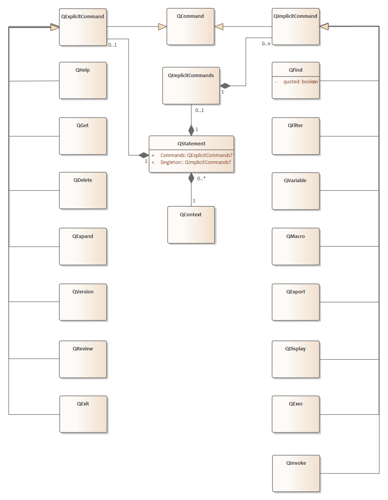

# Quelle Specification

##### version 4.4

### Background

Most modern search engines, provide a mechanism for searching via a text input box, where the user is expected to type search terms. While this interface is primitive from a UI perspective, it facilitates rich augmentation via search-specific semantics. Google pioneered the modern search interface by employing an elegantly simple "search box". This was an evolution away from the complex interfaces that preceded it. However, when a user searches for multiple terms, it becomes confusing how to obtain any results except "match every term".

The vast world of search is rife for a standardized search-syntax that moves us past only basic search capabilities. Without the introduction of a complicated search UI, Quelle represents a freely available specification for an open Human-Machine-Interface (HMI). It can be easily invoked from within a simple text input box on a web page or even from a specialized command shell. The syntax supports Boolean operations such as AND, OR, and NOT, albeit in a non-gear-headed way. While great care has been taken to support the construction of complex queries, greater care has been taken to maintain a clear and concise syntax.

Quelle, IPA: [kɛl], in French means "What? or Which?". As Quelle HMI is designed to obtain search-results from search-engines, this interrogative nature befits its name. In 2024, Quelle 4 was released. Search syntax has remained largely unchanged since version 1. Version 4 syntax is more streamlined than ever. Plus, it also comes with a reference implementation in Rust and a fully specified PEG grammar.

Quelle is consistent with itself. Some constructs make parsing unambiguous; other constructs increase ease of typing (Specifically, we attempt to minimize the need to press the shift-key). Naturally, existing scripting languages have some influence on our syntax. However, to avoid complexity, we favor simplicity of expression over versatility. There might be edge cases that where a more versatile grammar could have reduced keystrokes. Yet, we strived to keep Quelle simple. Avoiding nuance has produced a grammar that is easy to type, easy to learn, and easy to remember.  Moreover, most search expressions look no different than they might appear today in a Google or Bing search box. Still, let's not get ahead of ourselves or even hint about where our simple specification might take us ;-)

Vanilla Quelle specifies two possible implementation levels:

- Level 1 [basic search support]
- Level 2 [search support includes also searching on part-of-speech tags and fuzzy-match support]

### Overview of Quelle Syntax

There are two types of Quelle statements

| Statement Type       | Syntax                                                       |
| -------------------- | ------------------------------------------------------------ |
| Selection Statement  | Combines search criteria and scoping filters for tailored verse selection. Configuration settings can also be combined and incorporated into the selection criteria. |
| Imperative Statement | single action for configuration and/or application control (cannot be combined with other actions) |

#### Selection Criteria (includes search operations)

Selection Statement contains Selection Criteria, followed by an <u>optional</u> Directive:

The selection criteria controls how verses are selected. It is made up of one to three blocks. The ordering of blocks is partly prescribed. When present, the expression block must be in the initial position. The scoping block and/or the settings-block follow the expression block (when expressed). So long as scoping clauses are grouped into a single block <u>and</u> the settings clauses are grouped into a single block, those two blocks can be in either order (so long as they are listed after the expression block when it is expressed). 

- Search Expression Block
- Settings Block
- Scoping Block

| Block Position                         | Block Type                  | Hashtag Utilization Level |
| -------------------------------------- | --------------------------- | ------------------------- |
| ***initial***                          | **Search Expression Block** | full utilization          |
| *after expression block when provided* | **Settings Block**          | partial utilization       |
| *after expression block when provided* | **Scoping Block**           | partial utilization       |

An optional directive can be issued following the selection criteria.  Only zero or one directives can be issued within a  statement:  

- Macro Directive

- Export Directive

To be clear, a macro cannot be created for a statement that exports selection/search results to a file. Directives must be instigated separately.  The syntax for these directives is straightforward

| Directive Type                                               | Directive Syntax *(follows the Selection Criteria)*          |
| ------------------------------------------------------------ | ------------------------------------------------------------ |
| Macro (*apply* tag to macro)                                 | ***\|\| tag***                                               |
| Export Block (*export* results of selection criteria to a file) | ***> filepath*** or ***>> filepath*** or ***=> filepath*** |

#### Discrete Imperatives

Non-selection statements instigate configuration changes or application control. These statements always begin with **@**. They are executed individually and cannot be combined with any other actions. Imperatives that begin with @ cannot be combined with search expressions. This is why they are called Discrete Imperatives.

#### Configuration Statements

Quelle grammar supports three categories of configuration. These are described more completely in Section 2.

| Configuration Targets | Configuration Actions    |
| --------------------- | ------------------------ |
| User Settings         | @set, @get, @clear, @use |
| User Macros           | @view, @delete           |
| User History          | @view, @delete           |

#### Control Statements

Quelle gram has only two control imperatives. These are described more completely in Section 3.

| Control Targets   | Control Actions | Optional Parameter | Description                         |
| ----------------- | --------------- | ------------------ | ----------------------------------- |
| Usage Information | @help           | topic              | Help with Quelle syntax and usage   |
| System Control    | @exit           | -                  | Exit the application or interpreter |

## Section 1 - Selection/Search 

#### QuickStart

Consider this proximity search (find Moses and Aaron within a single span of seven words, along with a scoping [domain] filter):

*+span=7  Moses Aaron* < bible

Next, consider a search to find Moses <u>or</u> Aaron:

*Moses|Aaron* < bible

The order in which the search terms are provided is insignificant. Additionally, the type-case is insignificant. And either name found would constitute a match.

Of course, there are times when word order is significant. Accordingly, searching for explicit strings can be accomplished using double-quotes as follows:

*"Moses said ... Aaron"* < bible

These constructs can even be combined. For example:

*"Moses said ... Aaron|Miriam"* < bible

In all cases, “...” means “followed by”, but the ellipsis allows other words to appear between "said" and "Aaron". Likewise, it allows words to appear between "said" and "Miriam". 

Quelle is designed to be intuitive. It provides the ability to invoke Boolean logic for term-matching and/or linguistic feature-matching. As we saw above, the pipe symbol ( | ) can be used to invoke an *OR* condition.

The scoping deirective provided above is just for example puposes. A Quelle implementation could readily be defined to implement any of these scoping filters:

< YouTube videos

< Wall Street Journal 2024

< Disney Movies

### 1.1 - Selection Criteria

As we saw in the overview, there three blocks that compose Selection Criteria:

- Expression Block Components

  - *find expression*
  - *full hashtag utilization*
- Settings Block Components

  - *assign setting*

  - *partial hashtag utilization*
- Scoping Block

  - *filter directives*
  - *partial hashtag utilization*

| Action    | Type             | Position | Action Syntax                   | Repeatable Action                               |
| --------- | ---------------- | -------- | ------------------------------- | ----------------------------------------------- |
| *find*    | Expression Block | initial  | search expression or ***#tag*** | **no**                                          |
| *utilize* | Expression Block | initial  | ***#tag***                      | **no**: only one macro is permitted per block   |
| *assign*  | Settings Block   | initial  | ***+ setting = value***         | yes (e.g. ***+format=md  +span=7*** )           |
| *utilize* | Settings Block   | initial  | ***+ #tag***                    | **no**: only one hashtag is permitted per block |
| *filter*  | Scoping Block    | post     | ***< scope***                   | yes (e.g. ***< Genesis 3 < Revelation 1-3***)   |
| *utilize* | Scoping Block    | post     | **<** ***#tag***                | **no**: only one hashtag is permitted per block |

**Table 1-1** - Summary of actions expressible in the Selection Criteria segment of a Selection/Search imperative statement

Two mutually exclusive optional directives can be issued following the selection criteria. 

#### 1.1.1 - Search Expression Block

The ampersand symbol can similarly be used to represent *AND* conditions upon terms. As an example. the English language contains words that can sometimes as a noun , and other times as some other part-of-speech. To determine if the bible text contains the word "part" where it is used as a verb, we can issue this command:

"part&/verb/"

The SDK, provided by Digital-AV, has marked each word of the bible text for part-of-speech. With the rich syntax of Quelle, this type of search is easy and intuitive.

Of course, part-of-speech expressions can also be used independently of an AND condition, as follows:

"/noun/ ... home" +span=6 

That search would find phrases where a noun appeared within a span of six words, preceding the word "home"

**Valid statement syntax, but no results:**

this&that

/noun/ & /verb/

Both of the statements above are valid, but will not match any results. Search statements attempt to match actual words in  the actual bible text. A word cannot be "this" **and** "that". Likewise, an individual word in a sentence does not operate as a /noun/ **and** a /verb/ at the same time.

**Negating search-terms Example:**

Consider a query for all articles that contain a Bill Clinton in the Washington Post, followed by any word that is neither a verb nor an adverb:

"Bill|William ... Clinton -/v/ & -/adv/"  +span=15

#### 1.1.2 - Settings Block

When the same setting appears more than once, only the last setting in the list is preserved.  Example:

+format = md  +format = text

format would be set to text.  We call this: "last assignment wins".

Finally, there is a bit more to say about the similarity setting, because it actually has three components. If we issue this command, it affects similarity in two distinct ways:

+similarity = 85%

That command is a concise way of setting two values. It is equivalent to this command

+similarity.word = 85%  +similarity.lemma = 85%

That is to say, similarity is operative for the lexical word and also the lemma of the word. While not discussed previously, these two similarities thresholds need not be identical. These commands are also valid:

+similarity.word = 85%  +similarity.lemma = 95%

+similarity.word = 85%

+similarity.word = off +similarity.lemma = 100%

+similarity.lemma = off

#### 1.1.3 - Scoping Block

Sometimes we want to limit the scope of our search. Say that I want to find mentions of the serpent in Genesis. I can search only Genesis by executing this search:

serpent < Genesis

If I also want to search in Genesis and Revelation, this works:

serpent < Genesis < Revelation

Filters also allow Chapter and Verse specifications. To search for the serpent in Genesis Chapter 3, we can do this:

serpent < Genesis 3

Abbreviations are also supported:

vanity < sos < 1co

### 1.2 - Macro Directive

| Macro Directive *(follows the Selection Criteria)* | Syntax for applying tag to create a macro |
| -------------------------------------------------- | ----------------------------------------- |
| *apply*                                            | ***\|\| tag***                            |

**Table 1-2** - Syntax summary for the *apply* action in the Macro Directive of a Selection/Search imperative statement.

Tagged statements are also called macros. All macros are defined with a hash-tag (#); 

Macro tags cannot contain punctuation: only letters, numbers, hyphens, and underscores are permitted. However, macros are identified with a hash-tag (#).

Let’s say we want to name the search example from the previous section; We’ll call it *eternal-power*. To accomplish this, we can apply a tag to the statement below:

eternal power  +span=7 +similarity=85%  < Romans || eternal-power-romans

It’s that simple, now instead of typing the entire statement, we can utilize the macro by referencing our previously applied tag. Here is how the macro is utilized:

#eternal-power-romans

### 1.3 - Export Directive

| Export Directive  *(follows the Selection Criteria)* | Create file      | Create or Overwrite file | Create or Append File |
| ---------------------------------------------------- | ---------------- | :----------------------- | :-------------------- |
| *export*                                             | **>** *filename* | **=>** *filename*        | **>>** *filename*     |

**Table 1-3** - Syntax summary for the *export* action in the Export Directive of a Selection/Search imperative statement.

This would export all verses in Genesis 1 from the most previous search as html

#in_beginning +format = html  > my-macro-output.html

This would export all verses for the executed macro as markdown

#in_beginning +format = markdown  > my-macro-output.html

Combining only with a scoping black , we could append Genesis chapter two, to an existing file:

< Genesis 2  >> C:\users\my-user-name\documents\existing-file.md

Combining with a scoping black , we could replace the contents of an existing file with Genesis chapter three:

< Genesis 3  => C:\users\my-user-name\documents\existing-file.md

### 1.4 - Macro Utilization

Macro *utilize* is supported in each of the three Selection Criteria blocks:

- Expression *(full hashtag utilization)*
- Settings *(partial hashtag utilization)*
- Scoping *(partial hashtag utilization)*

Each of the block types supports hashtag *utilization*. However, each block limited to, a single hashtag one *utilization*. Hashtag *utilization* references a ta macro or a tag from the user's command history (as revealed by the @history command). As there are  a maximum of three blocks in the selection criteria, a statement can contain a maximum of three hashtag *utilizations* (one per block).

The expression block supports full macro utilization.  In the earlier example:

#eternal-power-romans

All settings, filters, and search criteria are utilized (this is called full macro utilization, and it can only occur in expression blocks)

Expression block macros sometimes undergo demotion. A macro within the expression block is demoted into a partial macro when a provided block within the selection criteria conflicts with the macro definition. Consider these examples:

Recall that the macro definition: eternal power +span = 7  +similarity = 85% < Romans || eternal-power-romans

| Macro Statement                      | Utilization level         | Explanation                                           |
| ------------------------------------ | ------------------------- | ----------------------------------------------------- |
| #eternal-power-romans                | full macro utilization    | no conflicts                                          |
| #eternal-power-romans < Acts         | partial macro utilization | explicit filter replaces any filters defined in macro |
| #eternal-power-romans +span=7 < Acts | partial macro utilization | only the search expression is utilized from the macro |

**Table 1-4** - Macro utilization in a Search Expression 

Outside of the expression block, hashtag *utilization* applies partialy, in accordance with the block type. For example, this clause utilizes only the settings defined within the macro:

\+ #eternal-power-romans

Likewise, in this example, this clause utilizes only the filters defined within the macro.

< #eternal-power-romans

Macro utilization within a block disallows all other entries within the block; macro utilization in a block is not compatible with any other entries in that same block.

Specifically, the following statements / clauses are not supported by Quelle:

**NOT SUPPORTED:**  #eternal-power-romans without excuse  

**NOT SUPPORTED:**  + #eternal-power-romans  +span=7

**NOT SUPPORTED:**  < #eternal-power-romans < Acts

It should be noted that any macros referenced within a macro definition are expanded prior to applying the new tag. Therefore, subsequent redefinition of a previously referenced macro invocation never affects existing macro definitions. We call this macro-determinism.  All control settings are captured at the time that the tag is applied to the macro. This further assures that the same search results are returned each time the macro is referenced. Here is an example.

@set span = 2

in beginning || in_beginning

@set span = 3

#in_beginning +span=1 < genesis 1

***result:*** none

### 1.5 - History Utilization

History *utilization* works identically to macro *utilization*:

- Expression *(full hashtag utilization)*
- Settings *(partial hashtag utilization)*
- Scoping *(partial hashtag utilization)*

Recall that each block type supports the *utilization* action. However, each block limited to, at most, one *utilization* action. The *utilization* action references a tag (e.g. a tag revealed by the @history imperative). As there are  a maximum of three blocks in the selection criteria, a statement could contain up to three *utilization* actions (one per block).

Only the expression block supports full macro utilization.

Expression block macros sometimes undergo demotion. A historic utilization within the expression block is demoted into a partial macro when a provided block within the selection criteria conflicts with the macro definition. Assume that this command is identified by the @view command by tag := 5:

"in ... beginning" +span=3  +similarity=85% < Genesis < John

| Statement          | Utilization level         | Explanation                                           |
| ------------------ | ------------------------- | ----------------------------------------------------- |
| #5                 | full macro utilization    | no conflicts                                          |
| #5 < Acts          | partial macro utilization | explicit filter replaces any filters defined in macro |
| #5 + span=7 < Acts | partial macro utilization | only the search expression is utilized from the macro |

**Table 1-5** - History utilization in a Search Expression 

Outside of the expression block, partial *usage* applies by block type. For example, this clause utilizes only the settings defined where tag = 5.

\+ #5

Likewise, in this example, this clause utilizes only the filters for tag = 5.

< #5

Just like macros, utilization within a block disallows all other entries within the block; utilization in a block is not compatible with any other entries in that same block.

Specifically, the following statements / clauses are not supported by Quelle:

**NOT SUPPORTED:**  #5 without excuse  

**NOT SUPPORTED:**  #5 +span=7

**NOT SUPPORTED:**  < #5 < Acts

It should be noted that any historic tag references are expanded prior to applying the new tags for macros. As mentioned in the previous section, we call this macro-determinism.  Therefore, even if a command is subsequently removed, any macros that it were referenced within, continue to behave identically post-deletion.

## Section 2 - Configuration Statements

### 2.1 - Macros

| Action             | Syntax                                                       |
| ------------------ | ------------------------------------------------------------ |
| **@view**          | *tag*                                                        |
| **@macros**        | *wildcard*  ***<- OR ->***   ***from*** {DATE} <u>and/or</u> ***to*** {DATE} |
| **@delete**        | *tag*                                                        |
| **@macros delete** | *wildcard*  ***<- OR ->***   ***from*** {DATE} <u>and/or</u> ***to*** {DATE} |
| **@use**           | *tag*                                                        |

**TABLE 2-1** -- **Viewing and deleting macros**

**DATE PARAMETER:** {DATE}: any of:

- yyyy/mm/dd
- yyyy-mm-dd
- mm/dd/yyyy
- mm-dd-yyyy

##### Overview of macro commands:

Viewing and Deletion of macros and history are nearly identical for single hashtag references. In the case of macros, we supply the tag name or label as a parameter to the view command:

\@view another-macro

If the user wanted to remove this definition, the \@delete action is used:

\@delete another-macro

If you want the same settings to be persisted to your current session that were in place during macro definition, the \@use command will persist all settings for the macro into your current session

\@use my-favorite-settings-macro 

**NOTE:**

​       \@use also works with search history.

### 2.2 - History

| Verb                | Parameters                                                   |
| ------------------- | ------------------------------------------------------------ |
| **@view**           | *tag*                                                        |
| **@history**        | *<u>optional:</u>*  ***from*** {DATE} <u>and/or</u> ***to*** {DATE} |
| **@delete**         | *tag*                                                        |
| **@history delete** | ***from*** {DATE} <u>and/or</u> ***to*** {DATE}              |
| **@use**            | *tag*                                                        |

**TABLE 2-2** -- **Viewing & deleting history**

**SEARCH HISTORY** 

*@history* allows you to see your previous activity.  To show the last ten searches, type:

*@history*

To reveal all searches since January 1, 2024, type:

*@history* from 2024/1/1

To reveal for the single month of January 2024:

*@history* from 2024/1/1 to 2024/1/31

All ranges are inclusive. 

**History Utilization**

The *utilization* command works for command-history works exactly the same way as it does for macros.  After issuing a *@view* command to show history, the user might receive a response as follows.

*@view 3*

3> eternal power

And hashtag *utilization* is invoked as follows:

#3

would be an abbreviated way to perform this identical search:

eternal power

As with macros, control settings are persisted within your command history to provide invocation determinism. That means that control settings that were in place during the original command are utilized for the invocation.

Command history captures all settings. We have already discussed macro-determinism. Invoking commands by their ids behave exactly like macros. In other words, invoking command history never persists changes into your environment, unless you explicitly request such behavior with the \@use command.

**RESETTING COMMAND HISTORY**

The *@history* command can be used to remove <u>all</u> command history. To remove all command history:

*@history delete all*

FROM / TO parameters can limit the scope of the delete command:

*@history delete from 12/31/2023 to 4/17/2024*

### 2.3 - Settings

| Action     | Parameters                   |
| ---------- | ---------------------------- |
| **@clear** | *setting* or ALL             |
| **@get**   | *setting* or ALL or revision |
| **@set**   | *setting* **=** *value*      |
| **@use**   | ***tag***                    |

**TABLE 2-3.a** - **Listing of additional CONTROL actions**

**Export Format Options:**

| Export Content Type | Command              | Synonym          |
| ------------------- | -------------------- | ---------------- |
| **Markdown**        | *@format = markdown* | *@format = md*   |
| **Text** (UTF8)     | *@format = text*     | *@format = utf8* |
| **HTML**            | *@format = html*     |                  |
| **YAML**            | *@format = yaml*     |                  |

**TABLE 2-3.b** - **@set** format command can be used to set the default content-formatting for use with the export verb

| **example**       | **explanation**                                              | shorthand equivalent |
| ----------------- | ------------------------------------------------------------ | -------------------- |
| **@set** span = 8 | Assign a control setting                                     | **@span** = 8        |
| **@get** span     | get a control setting                                        | **@span**            |
| **@clear** span   | Clear the setting; restores the setting to its default value/a |                      |

**TABLE 2-3.c** - **set/clear/get** action operate on configuration settings

In all, Quelle manifests five control names. Each allows all three actions: ***set***, ***clear***, and ***@get*** verbs. Table 2.3.d lists all Quelle settings. Some settings should only be expected in implementations that conform to the Level 2 specification.

| Setting Name     | Shorthand | Meaning                                                      | Values                          | Default Value | Spec Level |
| ---------------- | --------- | ------------------------------------------------------------ | ------------------------------- | ------------- | ---------- |
| span             | -         | proximity distance limit                                     | 0 to 999 or verse               | 0 / verse     | 1          |
| format           | -         | format of results on output                                  | see Table 7                     | text / utf8   | 2          |
| similarity       | -         | Streamlined syntax for setting similarity.word and similarity.lemma to the same value Phonetics matching threshold is between 33% and 100%. 100% represents an exact sounds-alike match. Any percentage less than 100, represents a fuzzy sounds-similar match  Similarity matching can be completely disabled by setting this value to off | 33% to 100% **or** *off*        | off           | 2          |
| similarity.word  | word      | fuzzy phonetics matching as described above, but this prefix only affects similarity matching on the word. | 33% to 100% **or** *off*        | off           | 2          |
| similarity.lemma | lemma     | fuzzy phonetics matching as described above, but this prefix only affects similarity matching on the lemma. | 33% to 100% **or** *off*        | off           | 2          |
| revision         | -         | Not really a true setting: it works with the @get command to retrieve the revision number of the Quelle grammar supported by AV-Engine. This value is read-only. | 4.x.yz                          | n/a           | 1          |
| ALL              | -         | ALL is an aggregate setting: it works with the @clear command to reset all variables above to their default values. It is used with @get to fetch all settings. | current **or** defaults | current       | 1          |

**TABLE 2-3.d** - Summary of AV-Bible Settings

The *@get* command fetches these values. The *@get* command requires a single argument. Examples are below:

*@get* span

@get format

All settings can be cleared using an explicit command:

@clear ALL

**Persistence of Settings**

It should be noted that there is a distinction between **@set** and and ***assign*** actions. The first action is an application configuration-imperative, and it is persistent (it affects all subsequent statements). Contrariwise, the ***assign*** action affects only the single statement wherein it is executed. We refer to this distinction as *persistence* vs *assignment*.

### 2.4 - Miscellaneous Information

**QUERYING DRIVER FOR VERSION INFORMATION**

This command reveals the current Quelle grammar revision:

@get revision

---

In general, the Quelle command processor can be thought of as a stateless server. The only exceptions of its stateless nature are:

1. non-default settings assigned using the **@set** command

2. defined macro tags. 

3. command history

   

## Section 3 - Control Statements

### 3.1 - Program Help

To get general help, use this command:

*@help*

Or for specific topics:

*@help* find

*@help* set

@help export

etc ...

### 3.2 - Exiting the Application

Type this to terminate the app:

*@exit*

## Section 4 - Grammar and Design Elements

An object model to manifest the Quelle grammar is depicted below:

### 4.1 - Glossary of Quelle Terminology

**Actions:** Actions are complete verb-clauses issued in the imperative [you-understood].  Many actions have one or more parameters.  But just like English, a verb phrase can be a single word with no explicit subject and no explicit object.  Consider this English sentence:

Go!

The subject of this sentence is "you understood".  Similarly, all verbs are issued without an explicit subject. The object of the verb in the one word sentence above is also unstated.  Quelle operates in an analogous manner.  Consider this English sentence:

Go Home!

Like the earlier example, the subject is "you understood".  The object this time is defined, and insists that "you" should go home.  Some verbs always have objects, others sometimes do, and still others never do. Quelle follows this same pattern and some Quelle verbs require direct-objects; and some do not.  In the various tables throughout this document, required and optional parameters are identified, These parameters represent the object of the verb within each respective table.

**Selection Criteria**: Selection what text to render is determined with a search expression, scoping filters, or both.

**Search Expression**: The Search Expression has fragments, and fragments have features. For an expression to match, all fragments must match (Logical AND). For a fragment to match, any feature must match (Logical OR). AND is represented by &. OR is represented by |.

**Unquoted SEARCH clauses:** an unquoted search clause contains one or more search fragments. If there is more than one fragment in the clause, then each fragment is logically AND’ed together.

**Quoted SEARCH clauses:** a quoted clause contains a single string of terms to search. An explicit match on the string is required. However, an ellipsis ( … ) can be used to indicate that other terms may silently intervene within the quoted string.

- It is called *quoted,* as the entire clause is sandwiched on both sides by double-quotes ( " )
- The absence of double-quotes means that the statement is unquoted

**Booleans and Negations:**

**and:** In Boolean logic, **and** means that all terms must be found. With Quelle, **and** is represented by terms that appear within an unquoted clause. **And** logic is also available on each search-term by using the **&** operator.

**or:** In Boolean logic, **or** means that any term constitutes a match. With Quelle, **and** is represented per each search-term by using the **|** operator.

**not:** In Boolean logic, means that the feature must not be found. With Quelle, *not* is represented by the hyphen ( **-** ) and applies to individual features within a fragment of a search expression. It is best used in conjunction with other features, because any non-match will be included in results. 

hyphen ( **-** ) means that any non-match satisfies the search condition. Used by itself, it would likely return every verse. Therefore, it should be used judiciously.

### 4.2 - Specialized Search tokens in Level #2 conformant dialects

The table below lists linguistic extensions in level #2 dialects of Quelle.

| Search Term        | Operator Type                           | Meaning                                                      | Maps To                                                      |
| ------------------ | --------------------------------------- | ------------------------------------------------------------ | ------------------------------------------------------------ |
| un\*               | wildcard (example)                      | starts with: un                                              | all lexical entries that start with "un"                     |
| \*ness             | wildcard (example)                      | ends with: ness                                              | all lexical entries that end with "ness"                     |
| un\*ness           | wildcard (example)                      | starts with: un ends with: ness                          | all lexical entries that start with "un", and end with "ness" |
| \*profit\*         | wildcard (example)                      | contains: profit                                             | all lexical entries that contain both "profit"               |
| \*pro\*fit\*       | wildcard (example)                      | contains: pro and fit                                        | all lexical entries that contain both "pro" and "fit" (in any order) |
| un\*profit*ness    | wildcard (example)                      | starts with: un contains: profit ends with: ness     | all lexical entries that start with "un", contain "profit", and end with "ness" |
| un\*pro\*fit\*ness | wildcard (example)                      | starts with: un contains: pro and fit ends with: ness | all lexical entries that start with "un", contain "pro" and "fit", and end with "ness" |
| ~ʃɛpɝd*            | phonetic wildcard (example)             | Tilde marks the wildcard as phonetic (wildcards never perform sounds-alike searching) | All lexical entries that start with the sound ʃɛpɝd (this would include shepherd, shepherds, shepherding...) |
| ~ʃɛpɝdz            | sounds-alike search using IPA (example) | Tilde marks the search term as phonetic (and if similarity is set between 33 and 99, search handles approximate matching) | This would match the lexical entry "shepherds" (and possibly similar terms, depending on similarity threshold) |
| \(is\)             | lemma                                   | search on all words that share the same lemma as is: be, is, are, ... | be is are ...                                                |
| /noun/             | lexical marker                          | any word where part of speech is a noun                      |                                                              |
| /n/                | lexical marker                          | synonym for /noun/                                           |                                                              |
| /verb/             | lexical marker                          | any word where part of speech is a verb                      |                                                              |
| /v/                | lexical marker                          | synonym for /verb/                                           |                                                              |
| /pronoun/          | lexical marker                          | any word where part of speech is a pronoun                   |                                                              |
| /pn/               | lexical marker                          | synonym for /pronoun/                                        |                                                              |
| /adjective/        | lexical marker                          | any word where part of speech is an adjective                |                                                              |
| /adj/              | lexical marker                          | synonym for /adjective/                                      |                                                              |
| /adverb/           | lexical marker                          | any word where part of speech is an adverb                   |                                                              |
| /adv/              | lexical marker                          | synonym for /adverb/                                         |                                                              |
| /determiner/       | lexical marker                          | any word where part of speech is a determiner                |                                                              |
| /det/              | lexical marker                          | synonym for /determiner/                                     |                                                              |
| /preposition/      | lexical marker                          | any word where part of speech is a preposition               |                                                              |
| /prep/             | lexical marker                          | any word where part of speech is a preposition               |                                                              |
| /1p/               | lexical marker                          | any word where it is inflected for 1st person (pronouns and verbs) |                                                              |
| /2p/               | lexical marker                          | any word where it is inflected for 2nd person (pronouns and verbs) |                                                              |
| /3p/               | lexical marker                          | any word where it is inflected for 3rd person (pronouns, verbs, and nouns) |                                                              |
| /singular/         | lexical marker                          | any word that is known to be singular (pronouns, verbs, and nouns) |                                                              |
| /plural/           | lexical marker                          | any word that is known to be plural (pronouns, verbs, and nouns) |                                                              |
| /WH/               | lexical marker                          | any word that is a WH word (e.g., Who, What, When, Where, How) |                                                              |
| /_/                | punctuation                             | any word that is immediately marked for clausal punctuation  |                                                              |
| /!/                | punctuation                             | any word that is immediately followed by an exclamation mark |                                                              |
| /?/                | punctuation                             | any word that is immediately followed by a question mark     |                                                              |
| /./                | punctuation                             | any word that is immediately followed by a period (declarative) |                                                              |
| /-/                | punctuation                             | any word that is immediately followed by a hyphen/dash       |                                                              |
| /;/                | punctuation                             | any word that is immediately followed by a semicolon         |                                                              |
| /,/                | punctuation                             | any word that is immediately followed by a comma             |                                                              |
| /:/                | punctuation                             | any word that is immediately followed by a colon (information follows) |                                                              |
| /'/                | punctuation                             | any word that is possessive, marked with an apostrophe       |                                                              |
| /)/                | parenthetical text                      | any word that is immediately followed by a close parenthesis |                                                              |
| /(/                | parenthetical text                      | any word contained within parenthesis                        |                                                              |

### Appendix

### AVX dialect of the Quelle specification

Quelle specifies two possible implementation levels:

- Level 1 [basic search support]
- Level 2 [search support includes also searching on part-of-speech tags]

Quelle-AVX is a Level 2 Quelle implementation with augmented search capabilities. Quelle-AVX extends Quelle to include AVX-Framework-specific constructs.  These extensions provide additional specialized search features and the ability to manage two distinct lexicons for the biblical texts.

1. Quelle-AVX represents the biblical text with two substantially similar, but distinct, lexicons. The search.lexicon setting can be specified by the user to control which lexicon is to be searched. Likewise, the render.lexicon setting is used to control which lexicon is used for displaying the biblical text. As an example, the KJV text of "thou art" would be modernized to "you are".

   - AV/KJV *(a lexicon that faithfully represents the KJV bible; AV purists should select this setting)*

   - AVX/Modern *(a lexicon that that has been modernized to appear more like contemporary English)*

   - Dual/Both *(use both lexicons)*

   The Dual/Both setting for +search=dual indicates that searching should consider both lexicons. The The Dual/Both setting for +render=dual indicates that results should be displayed for both renderings [whether this is side-by-side or in-parallel depends on the format and the application where the display-rendering occurs]. Left unspecified, the lexicon setting applies to search <u>and</u> render components.

2. Quelle-AVX provides support for fuzzy-match-logic. The similarity setting can be specified by the user to control the similarity threshold for approximate matching. An exact lexical match is expected when similarity is set to *off*.

   Phonetic matches are enabled when similarity is set between 33% and 100%. Similarity is calculated based upon the phonetic representation for the word.

   The minimum permitted similarity threshold is 33%. Any similarity threshold between 1% and 32% produces a syntax error.

   A similarity setting of 100% still uses phonetics, but expects a full phonetic match (e.g. "there" and "their" are a 100% phonetic match).

A reference implementation of AVX-Quelle can be found in the companion repositories of the Quelle specification.  A parser written in Rust can be found in the pinshot-blue repo. A fully realized object model that supports AVX-Quelle can be found in the AVX-Framework, which is documented in the AV-Engine repository.  AVX_Quelle represent the only known reference implementation of Quelle, to date.  AVX-Quelle is known as Imperative Control Language (ICL) in the AV-Bible-20224 application, soon to be found in the Microsoft Store.

